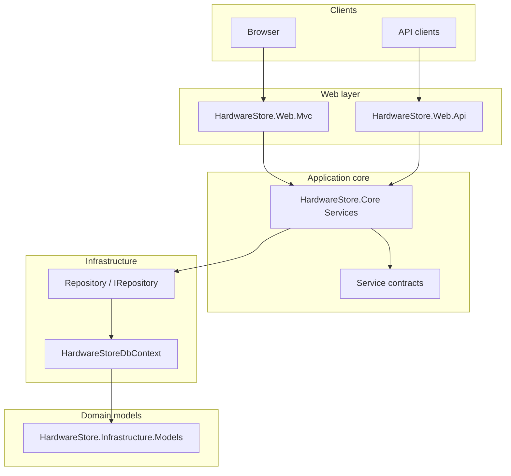

# Architecture and codebase

## High-level diagram

## Solution projects (under `src/`)

| Project | Responsibility |
|---------|----------------|
| **HardwareStore.Common** | Shared constants, exception messages, small cross-cutting helpers. |
| **HardwareStore.Infrastructure.Models** | Persistence-oriented entities and enums (e.g. `Product`, `Category`, `CategoryAssemblySlot`). |
| **HardwareStore.Infrastructure** | EF Core `DbContext`, entity configurations, `Repository`, migrations, SQL Server options extension. |
| **HardwareStore.Core.ViewModels** | DTOs and form models for MVC/API (including admin and product details view models). |
| **HardwareStore.Core** | Business logic: `ProductService`, `ShoppingCartService`, `OrderService`, `FavoriteService`; implements contracts in `Services.Contracts`. |
| **HardwareStore.Web.Mvc** | Controllers, Razor views, Identity UI integration, Admin area, view components (e.g. categories nav). |
| **HardwareStore.Web.Api** | REST controllers, JWT issuance/validation, Swagger. |
| **HardwareStore.Tests** | Unit and integration tests (NUnit, WebApplicationFactory for MVC). |

## Dependency injection (MVC)

Registered in extension methods under `HardwareStore.Web.Mvc/Extensions/`:

- **`ConfigurateDbContext`** — `HardwareStoreDbContext` with `UseHardwareStoreSqlServer`.
- **`ConfigurateIdentity`** — Identity for `Customer`, roles, cookies.
- **`AddServices`** — Scoped: `IRepository` → `Repository`, `IProductService`, `IFavoriteService`, `IShoppingCartService`, `IOrderService`.
- **`AddSearchPaths`** — Extra Razor view location for catalog partials under `Views/Shared/Catalog/`.

**Pipeline** (`Program.cs`): developer exception page / migrations endpoint (Development), HTTPS redirection, static files, routing, authentication, authorization, conventional routes + area route, Razor Pages.

**Security:** MVC uses `AutoValidateAntiforgeryToken` globally on controllers.

## Dependency injection (API)

- `AddHardwareStoreDbContext` — same SQL Server setup as MVC.
- `AddHardwareStoreDomainServices` — same core services as MVC.
- Identity EF stores on `HardwareStoreDbContext` (for user lookup / password validation where applicable).
- JWT authentication as default scheme.

## Repository pattern

- **`IRepository`** exposes `All`, `AllReadonly`, `AddAsync`, `SaveChangesAsync`, `ExecuteInRetryableTransactionAsync`, etc.
- **`Repository`** is the EF-backed implementation; **`ExecuteInRetryableTransactionAsync`** wraps work in `CreateExecutionStrategy().ExecuteAsync` + `Database.BeginTransactionAsync` so it is compatible with SQL Server retry policy.

## ViewModels vs entities

- **Entities** live in **Infrastructure.Models** and map directly to tables.
- **ViewModels** live in **Core.ViewModels** and are used for forms, API responses, and read models (e.g. product details with assembly components).

This separation keeps web-specific shapes out of the persistence model and avoids circular dependencies between web and infrastructure for most DTOs.

## Notable UI patterns

- **Categories navigation:** Implemented as a **`CategoriesNavViewComponent`** that queries `Category` rows grouped by `CategoryGroup` (Hardware vs Peripherals); empty groups are omitted.
- **Product catalog:** Shared Razor partials under `Views/Shared/Catalog/` (configured via `AddSearchPaths`).
- **Admin assembly editor:** Product create/edit includes a partial for **bundle / PC assembly** lines; client script filters a JSON catalog by each row’s **assembly slot** (see [Features](features-and-functionality.md)).

## Further detail (file-level and API/UI)

| Document | Contents |
|----------|----------|
| [solution-inventory.md](solution-inventory.md) | Verbose per-file catalog: Common, Models, Infrastructure, Core, MVC, API, Tests; migration `Up` summaries |
| [api-endpoints.md](api-endpoints.md) | REST methods, routes, auth, bodies, responses |
| [ui-views.md](ui-views.md) | Every Razor view/partial, model, controller action, catalog partial pipeline |
