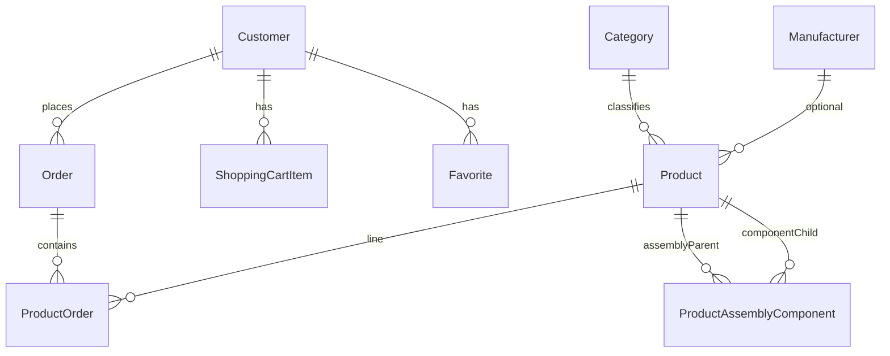

# Database and data model

Further reference: per-entity notes and migration list in **[solution-inventory.md](solution-inventory.md)** → *HardwareStore.Infrastructure.Models* and *Migrations*.

## Technology

- **SQL Server** via **Entity Framework Core 8**
- **Context:** [`HardwareStoreDbContext`](../src/Infrastructure/HardwareStore.Infrastructure/Data/HardwareStoreDbContext.cs) — **`IdentityDbContext<Customer>`**
- **CLI factory:** [`HardwareStoreDbContextFactory`](../src/Infrastructure/HardwareStore.Infrastructure/Data/HardwareStoreDbContextFactory.cs) for `dotnet ef`

## Entity relationship overview



- **Identity** tables (`AspNetUsers`, roles, claims, etc.) back **`Customer`** (`AspNetUsers` row shape extended with profile columns).
- **`Product`** is the hub: orders, cart, favorites, BOM parent (`AssemblyComponents`), BOM child (`UsedInAssemblies`).

## DbSets (explicit on context)

| DbSet | Maps to |
|-------|---------|
| `Products` | Sellable items + `Options` JSON |
| `Categories` | `Name`, `CategoryGroup`, `AssemblySlot` |
| `Manufacturers` | Brand |
| `Orders` | Order header (`Guid` PK) |
| *(via Identity)* | Users, roles |
| `ProductAssemblyComponents` | BOM lines |

Join entity **`ProductOrder`** links **`Order`** and **`Product`** with line quantity (configured in [`ProductOrderConfiguration`](../src/Infrastructure/HardwareStore.Infrastructure/Configurations/ProductOrderConfiguration.cs)).

## Notable delete behaviors (Fluent API)

| Relationship | Configuration | Behavior |
|--------------|---------------|----------|
| Assembly → parent product | [`ProductAssemblyComponentConfiguration`](../src/Infrastructure/HardwareStore.Infrastructure/Configurations/ProductAssemblyComponentConfiguration.cs) | **Cascade** when assembly product is deleted (BOM rows removed). |
| Assembly → component product | Same | **Restrict** — cannot delete a product that is still referenced as a **component** (aligns with admin “used in assembly” delete guard). |

Other FK cascades/restrict rules follow the **Initial** migration and EF conventions for optional/required relationships; see snapshot if you need exact SQL Server `ON DELETE` for every FK.

## Precision

- [`ProductConfiguration`](../src/Infrastructure/HardwareStore.Infrastructure/Configurations/ProductConfiguration.cs) and [`OrderConfiguration`](../src/Infrastructure/HardwareStore.Infrastructure/Configurations/OrderConfiguration.cs) set **decimal(18,2)** on `Price` / `TotalAmount`.

## Category groups and navigation

- **`CategoryGroup`:** `Hardware`, `Peripherals` — drives navbar grouping ([`CategoriesNavViewComponent`](../src/Web/HardwareStore.Web.Mvc/ViewComponents/CategoriesNavViewComponent.cs)).

## Category assembly slots

**`Category.AssemblySlot`** (`CategoryAssemblySlot`) drives admin BOM picker filtering and server validation (see [features-and-functionality.md](features-and-functionality.md)). Numeric values align with **`AssemblyRoleKind`** for standard slots (Cooler = 9; no “Custom” on category).

Predefined hardware category **names** receive slots via migration **`AddCategoryAssemblySlot`** (SQL `UPDATE`s). Admin category forms may not edit **AssemblySlot** yet — new categories default to **None**.

## Migrations

All `Up` summaries are listed in **[solution-inventory.md](solution-inventory.md)** (*Migrations* table). Highlights:

- **Initial** — full schema + Identity.
- **RemoveCharacteristicsTables** — `Products.Options` JSON replaces old characteristic tables.
- **SeedAdminUserAndRole** — admin login.
- **AddCategoryGroup**, **AddProductAssemblyComponents**, **SeedPredefinedHardwareCategories**, **AddCategoryAssemblySlot**.
- **AddFullTextSearchCatalogAndIndexes** — optional FTS DDL when SQL Server supports it (app still uses **LIKE** in `ProductService`).

Apply:

```bash
dotnet ef database update --project src/Infrastructure/HardwareStore.Infrastructure --startup-project src/Web/HardwareStore.Web.Mvc
```

## Transactions and consistency

- **`OrderService.OrderAsync`** uses **`IRepository.ExecuteInRetryableTransactionAsync`** so order placement is compatible with **`EnableRetryOnFailure`** (see [server-and-deployment.md](server-and-deployment.md)).
- Simple CRUD uses **`SaveChangesAsync`** without an explicit transaction.

## Indexes and search

- **Runtime search:** **`EF.Functions.Like`** in [`ProductService.LoadSearchByKeywordAsync`](../src/Core/HardwareStore.Core/Services/ProductService.cs) with `[`, `%`, `_` escaped.
- **Full-text:** Migration creates catalog/indexes **only if** `FULLTEXTSERVICEPROPERTY('IsFullTextInstalled') = 1`; application code does not call `CONTAINS`/`FREETEXT` in the current `ProductService` path.

## Snapshot and designers

- **`HardwareStoreDbContextModelSnapshot.cs`** — single source of truth for the **current** EF model when adding migrations.
- Each **`*.Designer.cs`** next to a migration — generated; do not hand-edit.
