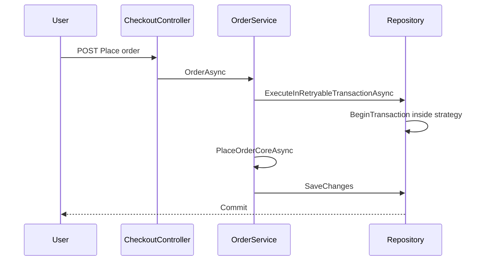

# Features and functionality

Feature-oriented map of behavior with pointers to **[solution-inventory.md](solution-inventory.md)** (source files), **[ui-views.md](ui-views.md)** (Razor), and **[api-endpoints.md](api-endpoints.md)** (REST).

---

## Home

**Behavior:** Shows “most bought” and “newest” product strips (`ProductService.GetHomeViewModelAsync`).

**MVC:** [`HomeController.Index`](../src/Web/HardwareStore.Web.Mvc/Controllers/HomeController.cs) → [`Views/Home/Index.cshtml`](../src/Web/HardwareStore.Web.Mvc/Views/Home/Index.cshtml) with [`_HomePartialView`](../src/Web/HardwareStore.Web.Mvc/Views/Shared/Catalog/_HomePartialView.cshtml).

**API:** `GET api/Home` — same view model for JSON clients.

**See also:** [ui-views.md](ui-views.md) (home flow), [solution-inventory.md](solution-inventory.md) → ProductService.

---

## Category catalog and filters

**Behavior:**

1. User opens **Products** menu → [`CategoriesNavViewComponent`](../src/Web/HardwareStore.Web.Mvc/ViewComponents/CategoriesNavViewComponent.cs) lists categories from DB by `CategoryGroup`.
2. **`Product/Index?category=&title=`** checks category exists; loads `GetCategoryCatalogAsync` (builds filter facets from manufacturer + `Options` JSON keys).
3. **POST `Product/Filter`** — [`CatalogFilterFormHelper.BuildFilterJson`](../src/Web/HardwareStore.Web.Mvc/Helpers/CatalogFilterFormHelper.cs) turns form fields into JSON; `FilterCategoryCatalogAsync` applies manufacturer + option filters and sort (`ProductOrdering` from hidden `Order`).

**MVC:** [`ProductController`](../src/Web/HardwareStore.Web.Mvc/Controllers/ProductController.cs); view [`Product/Catalog.cshtml`](../src/Web/HardwareStore.Web.Mvc/Views/Product/Catalog.cshtml) (search branch uses same file — see Search).

**API:** `GET/POST api/categories/{category}/catalog` — [`CategoryCatalogController`](../src/Web/HardwareStore.Web.Api/Controllers/CategoryCatalogController.cs).

**See also:** [ui-views.md](ui-views.md) (catalog partial pipeline), [api-endpoints.md](api-endpoints.md).

---

## Product details and assembly (BOM)

**Behavior:** Single product page: image placeholder, price, add-to-cart, **JSON attributes** (`Options`), **assembly table** for bundle/PC products (component name, ref, price, quantity per line).

**Data:** [`ProductService.GetProductDetails`](../src/Core/HardwareStore.Core/Services/ProductService.cs) includes `AssemblyComponents` → `ComponentProduct`; maps to [`AssemblyComponentModel`](../src/Core/HardwareStore.Core.ViewModels/Details/AssemblyComponentModel.cs).

**MVC:** [`ProductController.Details`](../src/Web/HardwareStore.Web.Mvc/Controllers/ProductController.cs) → [`Product/Details.cshtml`](../src/Web/HardwareStore.Web.Mvc/Views/Product/Details.cshtml); favorite partial when signed in.

**API:** `GET api/products/{id}` — [`ProductDetailsController`](../src/Web/HardwareStore.Web.Api/Controllers/ProductDetailsController.cs); optional `IsFavorite` when JWT present.

**See also:** [database-and-data-model.md](database-and-data-model.md) (BOM entity), [solution-inventory.md](solution-inventory.md) → ProductAssemblyComponent.

---

## Search

**Behavior:** Keyword search uses **`EF.Functions.Like`** with pattern escaping on product name, description, model, manufacturer name (`LoadSearchByKeywordAsync`). Empty keyword loads all products for browsing in search UI.

**MVC:** [`SearchController`](../src/Web/HardwareStore.Web.Mvc/Controllers/SearchController.cs) renders **`~/Views/Product/Catalog.cshtml`** with `SearchKeyword` set; POST **`FilterSearch`** reapplies filters on search result set.

**API:** [`SearchController`](../src/Web/HardwareStore.Web.Api/Controllers/SearchController.cs) under `api/search`.

**See also:** [database-and-data-model.md](database-and-data-model.md) (LIKE vs FTS), [api-endpoints.md](api-endpoints.md).

---

## Favorites

**Behavior:** Logged-in users add/remove favorites; list page shows export models.

**MVC:** [`FavoriteController`](../src/Web/HardwareStore.Web.Mvc/Controllers/FavoriteController.cs) (`[Authorize]`); [`FavoriteService`](../src/Core/HardwareStore.Core/Services/FavoriteService.cs).

**API:** `api/Favorites` — [`FavoritesController`](../src/Web/HardwareStore.Web.Api/Controllers/FavoritesController.cs) (JWT).

**See also:** [ui-views.md](ui-views.md) → Favorite/Index, `_FavoritePartialView`, `_ProductFavoritePartial`.

---

## Shopping cart

**Behavior:** Persistent cart per **Customer** (not session-only). Add validates stock; quantity increase validates aggregate vs `Product.Quantity`.

**MVC:** [`CartController`](../src/Web/HardwareStore.Web.Mvc/Controllers/CartController.cs) — index, add (POST), remove, inc/dec, update quantity form.

**API:** [`CartController`](../src/Web/HardwareStore.Web.Api/Controllers/CartController.cs) — REST shape (JWT on class).

**See also:** [solution-inventory.md](solution-inventory.md) → ShoppingCartService.

---

## Checkout and orders

**Behavior:** Checkout pre-fills `OrderFormModel` from customer profile and computes **total from cart**. Placing order runs inside **`ExecuteInRetryableTransactionAsync`**: validate cart, decrement stock, create `Order` + `ProductOrder` rows, clear cart.

**MVC:** [`CheckoutController`](../src/Web/HardwareStore.Web.Mvc/Controllers/CheckoutController.cs), [`OrdersController`](../src/Web/HardwareStore.Web.Mvc/Controllers/OrdersController.cs).

**API:** [`CheckoutController`](../src/Web/HardwareStore.Web.Api/Controllers/CheckoutController.cs), [`OrdersController`](../src/Web/HardwareStore.Web.Api/Controllers/OrdersController.cs).

**See also:** [database-and-data-model.md](database-and-data-model.md) (transactions), [api-endpoints.md](api-endpoints.md).

---

## Profile

**Behavior:** Display name, city, address, email (MVC). API supports full profile field update via **UserManager**.

**MVC:** [`ProfileController`](../src/Web/HardwareStore.Web.Mvc/Controllers/ProfileController.cs) — read-only display in repo.

**API:** [`ProfileController`](../src/Web/HardwareStore.Web.Api/Controllers/ProfileController.cs) GET/PUT.

---

## Authentication (MVC)

**Behavior:** [`UserController`](../src/Web/HardwareStore.Web.Mvc/Controllers/UserController.cs) — register, login, logout; **EasyLogin** for streamlined dev login if present. Uses **SignInManager** / **UserManager** with cookie scheme.

**Identity pages:** Only [`Areas/Identity/Pages/_ViewStart.cshtml`](../src/Web/HardwareStore.Web.Mvc/Areas/Identity/Pages/_ViewStart.cshtml) in tree — full Identity UI not scaffolded into repo beyond that hook.

**API:** [`AuthController`](../src/Web/HardwareStore.Web.Api/Controllers/AuthController.cs) — JWT login/register; logout is client-side token discard.

**See also:** [server-and-deployment.md](server-and-deployment.md) (JWT config), [api-endpoints.md](api-endpoints.md).

---

## Administration (`/Admin`)

**Gate:** [`AdminControllerBase`](../src/Web/HardwareStore.Web.Mvc/Areas/Admin/Controllers/AdminControllerBase.cs) — `[Authorize(Roles = Admin)]`.

| Feature | Controller | Views |
|---------|------------|-------|
| Dashboard | `Admin.HomeController` | `Areas/Admin/Views/Home/Index.cshtml` |
| Products | [`ProductsController`](../src/Web/HardwareStore.Web.Mvc/Areas/Admin/Controllers/ProductsController.cs) | Index, Create, Edit + [`_AssemblyComponentsPartial`](../src/Web/HardwareStore.Web.Mvc/Areas/Admin/Views/Shared/_AssemblyComponentsPartial.cshtml) |
| Categories | [`CategoriesController`](../src/Web/HardwareStore.Web.Mvc/Areas/Admin/Controllers/CategoriesController.cs) | CRUD (Name, Group; **AssemblySlot** not on form — see DB doc) |
| Manufacturers | [`ManufacturersController`](../src/Web/HardwareStore.Web.Mvc/Areas/Admin/Controllers/ManufacturersController.cs) | CRUD + delete guard if products reference |
| Customers | [`CustomersController`](../src/Web/HardwareStore.Web.Mvc/Areas/Admin/Controllers/CustomersController.cs) | Paged index, edit profile |

### Assembly (bundle / PC) editor

- **Persisted** as [`ProductAssemblyComponent`](../src/Infrastructure/HardwareStore.Infrastructure.Models/ProductAssemblyComponent.cs) rows (`Role`, `Quantity`, `SortOrder`).
- **Admin UI:** JSON catalog `{ id, label, slot }` from server; client filters by **`slot` == `AssemblyRoleKind`**; **None** and **Custom** show all products.
- **Validation:** [`AssemblyRoleMapping`](../src/Core/HardwareStore.Core.ViewModels/Admin/AssemblyRoleMapping.cs) + category **`AssemblySlot`**; **Options** on product must be valid JSON object on save.

**Product delete:** Blocked if product appears in orders, carts, favorites, or as another product’s assembly component.

**See also:** [ui-views.md](ui-views.md) (admin tables), [solution-inventory.md](solution-inventory.md).

---

## REST API parity

The API reuses **Core services** and **ViewModels** for payloads. Full route list: **[api-endpoints.md](api-endpoints.md)**. **CORS** is not enabled — browser SPAs on another origin need configuration or a proxy.

---

## Tests

| Type | Location | Notes |
|------|----------|-------|
| Unit | [`HardwareStore.Tests/Unit/`](../src/Tests/HardwareStore.Tests/Unit/) | Services, `AssemblyRoleMapping` |
| Integration | [`Integration/`](../src/Tests/HardwareStore.Tests/Integration/) | `WebApplicationFactory` → MVC `Program`; production error page tests |

**See:** [solution-inventory.md](solution-inventory.md) → HardwareStore.Tests.

---

## Cross-cutting rules

- **Antiforgery:** Global on MVC controllers (`AutoValidateAntiforgeryToken`).
- **Admin role:** Seeded in migration `SeedAdminUserAndRole`.
- **Logging:** [`LogMessages`](../src/Common/HardwareStore.Common/LogMessages.cs) templates in controllers.
