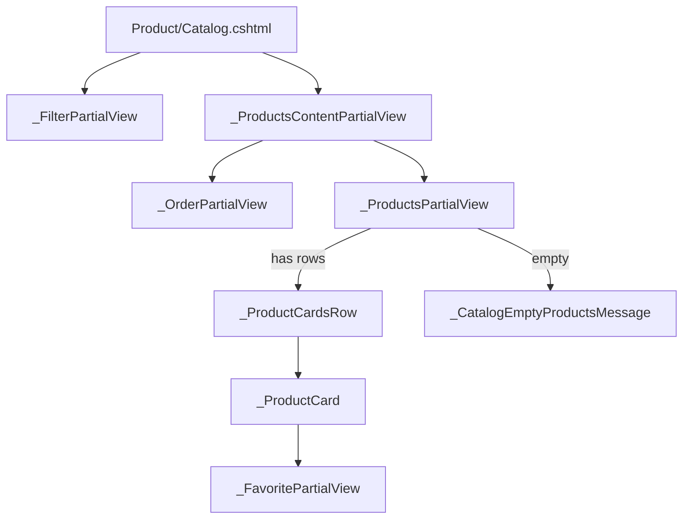
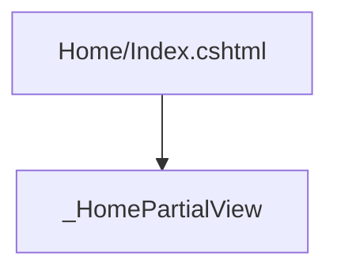

# MVC Razor views and partials

All paths are under [`HardwareStore.Web.Mvc`](../src/Web/HardwareStore.Web.Mvc/). Shared catalog partials resolve via extra view location **`/Views/Shared/Catalog/`** (see [`AddSearchPathsExtension`](../src/Web/HardwareStore.Web.Mvc/Extensions/AddSearchPathsExtension.cs)).

---

## View flow diagrams

### Category catalog (`Product/Index` → `Catalog`)

- **Forms:** `Product/Catalog.cshtml` wraps content in POST to **`Product/Filter`** (category) or **`Search/FilterSearch`** (when `SearchKeyword` is set).

### Search catalog

- **`Search/Index`** and **`Search/FilterSearch`** render the same physical view: **`~/Views/Product/Catalog.cshtml`** with **`CatalogPageViewModel`** (`SearchKeyword` populated for search branch).

### Home

---

## Root `Views/` pages

| View | Model | Rendered by | Purpose |
|------|-------|-------------|---------|
| [`Home/Index.cshtml`](../src/Web/HardwareStore.Web.Mvc/Views/Home/Index.cshtml) | `HomeViewModel` | `HomeController.Index` | Welcome + newest / most-bought sections via `_HomePartialView`. |
| [`Home/Error.cshtml`](../src/Web/HardwareStore.Web.Mvc/Views/Home/Error.cshtml) | `ErrorViewModel?` | `HomeController.Error` | User-facing error with optional message. |
| [`Product/Catalog.cshtml`](../src/Web/HardwareStore.Web.Mvc/Views/Product/Catalog.cshtml) | `CatalogPageViewModel` | `ProductController.Index`, `ProductController.Filter`, `SearchController.Index`, `SearchController.FilterSearch` | Title, filter sidebar + product grid (see diagram above). |
| [`Product/Details.cshtml`](../src/Web/HardwareStore.Web.Mvc/Views/Product/Details.cshtml) | `ProductDetailsModel` | `ProductController.Details` | Image, price, favorite partial, add-to-cart, attributes table, **assembly components** list. |
| [`Cart/Index.cshtml`](../src/Web/HardwareStore.Web.Mvc/Views/Cart/Index.cshtml) | `ShoppingCartViewModel` | `CartController.Index` | Line items, qty controls, checkout link (`[Authorize]`). |
| [`Checkout/Index.cshtml`](../src/Web/HardwareStore.Web.Mvc/Views/Checkout/Index.cshtml) | `OrderFormModel` | `CheckoutController.Index` | Shipping/payment form (`[Authorize]`). |
| [`Checkout/Success.cshtml`](../src/Web/HardwareStore.Web.Mvc/Views/Checkout/Success.cshtml) | (none / ViewData) | `CheckoutController.Success` | Post-order confirmation. |
| [`Orders/Index.cshtml`](../src/Web/HardwareStore.Web.Mvc/Views/Orders/Index.cshtml) | `IEnumerable<OrderViewModel>` | `OrdersController.Index` | Order history. |
| [`Favorite/Index.cshtml`](../src/Web/HardwareStore.Web.Mvc/Views/Favorite/Index.cshtml) | `ICollection<FavoriteExportModel>` | `FavoriteController.Index` | Favorites list. |
| [`Profile/Index.cshtml`](../src/Web/HardwareStore.Web.Mvc/Views/Profile/Index.cshtml) | `ProfileViewModel` | `ProfileController.Index` | Account summary. |
| [`User/Login.cshtml`](../src/Web/HardwareStore.Web.Mvc/Views/User/Login.cshtml) | `LoginFormModel` | `UserController.Login` | Login form (+ EasyLogin if used). |
| [`User/Register.cshtml`](../src/Web/HardwareStore.Web.Mvc/Views/User/Register.cshtml) | `RegisterFormModel` | `UserController.Register` | Registration. |
| [`_ViewImports.cshtml`](../src/Web/HardwareStore.Web.Mvc/Views/_ViewImports.cshtml) | — | — | Global namespaces and tag helpers. |
| [`_ViewStart.cshtml`](../src/Web/HardwareStore.Web.Mvc/Views/_ViewStart.cshtml) | — | — | Sets default layout for `Views/`. |

---

## `Views/Shared/` layout and fragments

| View | Model | Used by | Purpose |
|------|-------|---------|---------|
| [`Shared/_Layout.cshtml`](../src/Web/HardwareStore.Web.Mvc/Views/Shared/_Layout.cshtml) | — | Default layout | Navbar, Products dropdown via **`@await Component.InvokeAsync("CategoriesNav")`**, search form, auth links, footer, scripts. |
| [`Shared/_LoginFormPartial.cshtml`](../src/Web/HardwareStore.Web.Mvc/Views/Shared/_LoginFormPartial.cshtml) | — | Layout (if embedded) | Compact login form fragment. |
| [`Shared/_ValidationScriptsPartial.cshtml`](../src/Web/HardwareStore.Web.Mvc/Views/Shared/_ValidationScriptsPartial.cshtml) | — | Pages needing jQuery validation | Client validation scripts. |
| [`Shared/_ProductFavoritePartial.cshtml`](../src/Web/HardwareStore.Web.Mvc/Views/Shared/_ProductFavoritePartial.cshtml) | `DetailsFavoriteModel` | `Product/Details` | Favorite toggle UI for signed-in users. |
| [`Shared/Components/CategoriesNav/Default.cshtml`](../src/Web/HardwareStore.Web.Mvc/Views/Shared/Components/CategoriesNav/Default.cshtml) | `IReadOnlyList<CategoryNavGroupViewModel>` | `CategoriesNavViewComponent` | Nested Bootstrap dropdowns for Hardware / Peripherals categories. |

---

## `Views/Shared/Catalog/` partials

| Partial | Model | Purpose |
|---------|-------|---------|
| [`_FilterPartialView.cshtml`](../src/Web/HardwareStore.Web.Mvc/Views/Shared/Catalog/_FilterPartialView.cshtml) | `FilterPartialViewModel` | Manufacturer and JSON-option checkboxes + hidden `Order`. |
| [`_OrderPartialView.cshtml`](../src/Web/HardwareStore.Web.Mvc/Views/Shared/Catalog/_OrderPartialView.cshtml) | `int` (selected order) | Sort dropdown (`ProductOrdering`). |
| [`_ProductsContentPartialView.cshtml`](../src/Web/HardwareStore.Web.Mvc/Views/Shared/Catalog/_ProductsContentPartialView.cshtml) | `CatalogPageViewModel` | Hosts order strip + `_ProductsPartialView`. |
| [`_ProductsPartialView.cshtml`](../src/Web/HardwareStore.Web.Mvc/Views/Shared/Catalog/_ProductsPartialView.cshtml) | `IEnumerable<ProductViewModel>` | Routes to `_ProductCardsRow` or `_CatalogEmptyProductsMessage` (items are **`CatalogProductViewModel`** in practice). |
| [`_ProductCardsRow.cshtml`](../src/Web/HardwareStore.Web.Mvc/Views/Shared/Catalog/_ProductCardsRow.cshtml) | `IEnumerable<ProductViewModel>` | Responsive row of `_ProductCard`. |
| [`_ProductCard.cshtml`](../src/Web/HardwareStore.Web.Mvc/Views/Shared/Catalog/_ProductCard.cshtml) | `ProductViewModel` | Card UI + `_FavoritePartialView` for list context. |
| [`_FavoritePartialView.cshtml`](../src/Web/HardwareStore.Web.Mvc/Views/Shared/Catalog/_FavoritePartialView.cshtml) | `ProductViewModel` | Heart / favorite control for catalog cards. |
| [`_HomePartialView.cshtml`](../src/Web/HardwareStore.Web.Mvc/Views/Shared/Catalog/_HomePartialView.cshtml) | `IEnumerable<ProductViewModel>` | Home page product strip (reuses card styling). |
| [`_CatalogEmptyProductsMessage.cshtml`](../src/Web/HardwareStore.Web.Mvc/Views/Shared/Catalog/_CatalogEmptyProductsMessage.cshtml) | — | Empty state copy. |

---

## Admin area `Areas/Admin/Views/`

| View | Model | Rendered by | Purpose |
|------|-------|-------------|---------|
| [`_ViewStart.cshtml`](../src/Web/HardwareStore.Web.Mvc/Areas/Admin/Views/_ViewStart.cshtml) | — | — | Admin layout. |
| [`_ViewImports.cshtml`](../src/Web/HardwareStore.Web.Mvc/Areas/Admin/Views/_ViewImports.cshtml) | — | — | Admin namespaces (`Admin` view models, `AssemblyRoleKind`, etc.). |
| [`Shared/_Layout.cshtml`](../src/Web/HardwareStore.Web.Mvc/Areas/Admin/Views/Shared/_Layout.cshtml) | — | Admin chrome | Admin nav links (products, categories, manufacturers, customers). |
| [`Shared/_AssemblyComponentsPartial.cshtml`](../src/Web/HardwareStore.Web.Mvc/Areas/Admin/Views/Shared/_AssemblyComponentsPartial.cshtml) | `ProductFormModel` | `Products/Create`, `Products/Edit` | BOM table: role dropdowns, custom label, product select (JSON catalog + slot filter script), qty, add/remove rows. |
| [`Home/Index.cshtml`](../src/Web/HardwareStore.Web.Mvc/Areas/Admin/Views/Home/Index.cshtml) | — | `Admin.HomeController.Index` | Admin dashboard stub. |
| [`Products/Index.cshtml`](../src/Web/HardwareStore.Web.Mvc/Areas/Admin/Views/Products/Index.cshtml) | `IEnumerable<ProductListItemViewModel>` | `ProductsController.Index` | Product list + actions. |
| [`Products/Create.cshtml`](../src/Web/HardwareStore.Web.Mvc/Areas/Admin/Views/Products/Create.cshtml) | `ProductFormModel` | `ProductsController.Create` | Create product + `_AssemblyComponentsPartial`. |
| [`Products/Edit.cshtml`](../src/Web/HardwareStore.Web.Mvc/Areas/Admin/Views/Products/Edit.cshtml) | `ProductFormModel` | `ProductsController.Edit` | Edit product + assembly. |
| [`Categories/Index.cshtml`](../src/Web/HardwareStore.Web.Mvc/Areas/Admin/Views/Categories/Index.cshtml) | `IEnumerable<Category>` | `CategoriesController.Index` | Category list. |
| [`Categories/Create.cshtml`](../src/Web/HardwareStore.Web.Mvc/Areas/Admin/Views/Categories/Create.cshtml) | `CategoryFormModel` | `CategoriesController.Create` | New category. |
| [`Categories/Edit.cshtml`](../src/Web/HardwareStore.Web.Mvc/Areas/Admin/Views/Categories/Edit.cshtml) | `CategoryFormModel` | `CategoriesController.Edit` | Edit category. |
| [`Manufacturers/Index.cshtml`](../src/Web/HardwareStore.Web.Mvc/Areas/Admin/Views/Manufacturers/Index.cshtml) | `IEnumerable<Manufacturer>` | `ManufacturersController.Index` | Manufacturer list. |
| [`Manufacturers/Create.cshtml`](../src/Web/HardwareStore.Web.Mvc/Areas/Admin/Views/Manufacturers/Create.cshtml) | `ManufacturerFormModel` | `ManufacturersController.Create` | New manufacturer. |
| [`Manufacturers/Edit.cshtml`](../src/Web/HardwareStore.Web.Mvc/Areas/Admin/Views/Manufacturers/Edit.cshtml) | `ManufacturerFormModel` | `ManufacturersController.Edit` | Edit manufacturer. |
| [`Customers/Index.cshtml`](../src/Web/HardwareStore.Web.Mvc/Areas/Admin/Views/Customers/Index.cshtml) | `AdminCustomersIndexViewModel` | `CustomersController.Index` | Paged customers. |
| [`Customers/Edit.cshtml`](../src/Web/HardwareStore.Web.Mvc/Areas/Admin/Views/Customers/Edit.cshtml) | `CustomerEditFormModel` | `CustomersController.Edit` | Edit customer. |

---

## Identity scaffold

| View | Purpose |
|------|---------|
| [`Areas/Identity/Pages/_ViewStart.cshtml`](../src/Web/HardwareStore.Web.Mvc/Areas/Identity/Pages/_ViewStart.cshtml) | Layout for Identity Razor Pages if expanded; currently the only file under **Identity/Pages**. |

---

## Related docs

- [solution-inventory.md](solution-inventory.md) — controllers and view component  
- [features-and-functionality.md](features-and-functionality.md) — behavior by feature  
